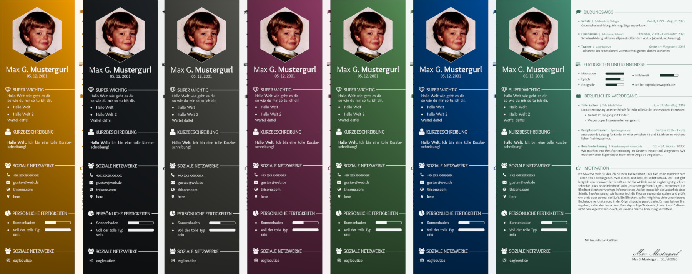

  

# latex-maverick

A (standalone) documentclass to typeset Applications in LaTeX.

This class is a LaTeX2e-Class that allows you to create a banner-application with ease. The following Image presents the application in different color-variants:

It also offers support for complete custom-LaTeX-Pages, document-attachments and cake-diagrams. Use and customize as you want.
